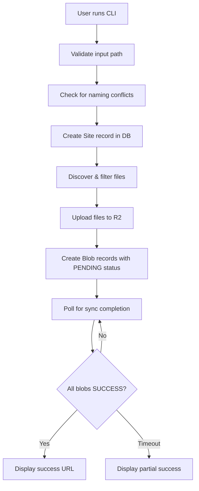

# FlowerShow CLI - Stage 1 Implementation Plan

## Overview

A minimal Node.js CLI tool that enables direct publishing of Markdown files/folders to FlowerShow without Git or authentication, validating the "file → URL in seconds" concept.

## Design Decisions Summary

### User & Project Management

- **Anonymous User**: All CLI uploads use a single "anonymous" user (ghUsername: "anonymous")
- **Project Naming**:
  - Single file: Use filename as project name, save as `README.md` (or `.mdx`)
  - Folder: Use folder name as project name
  - Conflicts: Fail with clear error message listing existing sites
- **Branch**: Always use "main" as the branch name
- **URL Pattern**: `https://flowershow.app/@anonymous/{project-name}`

### CLI Structure

- **Location**: `/cli` directory in main repository
- **Type**: Simple Node.js script (not an npm package yet)
- **Commands**:
  - `node cli.js publish <path>` - Publish file or folder
  - `node cli.js list` - List all anonymous user's sites
  - `node cli.js delete <project-name>` - Delete a site
- **Configuration**: Read from `.env` file in CLI directory

### File Handling

- **Smart Filtering**: Ignore common non-content directories/files:
  - `.git/`, `node_modules/`, `.DS_Store`, `Thumbs.db`
  - `.env*`, `*.log`, `.cache/`, `dist/`, `build/`
- **Supported Files**: All files that FlowerShow currently supports
  - Markdown: `.md`, `.mdx`
  - Images: `.png`, `.jpg`, `.jpeg`, `.gif`, `.svg`, `.webp`, `.avif`
  - Documents: `.pdf`
  - Data: `.csv`, `.json`, `.yaml`, `.yml`, `.geojson`
  - Other: `.css`, `.ico`

### Upload & Processing Flow



### Database Operations

1. **Site Creation**:

```typescript
{
  projectName: string,        // from file/folder name
  ghRepository: "cli-upload", // placeholder
  ghBranch: "main",          // always "main"
  rootDir: null,             // no root dir for CLI
  autoSync: false,           // no GitHub sync
  webhookId: null,           // no webhook
  userId: anonymousUserId,   // the anonymous user
  // other fields use defaults
}
```

2. **Blob Creation** (for each file):

```typescript
{
  siteId: string,
  path: string,              // relative path in project
  appPath: string | null,    // URL path (for .md/.mdx only)
  size: number,
  sha: string,               // file hash
  metadata: null,            // will be populated by worker
  extension: string,
  syncStatus: "PENDING",     // for .md/.mdx, "SUCCESS" for others
  syncError: null,
}
```

### Post-Upload Processing

- **No Inngest trigger**: Files are uploaded directly to R2
- **Cloudflare Worker**: Automatically processes uploaded files
  - Parses markdown frontmatter
  - Extracts metadata
  - Updates Blob status from PENDING → SUCCESS
- **CLI Polling**: Check blob status every 1 second
  - Query all blobs for the site
  - Wait until all markdown files are SUCCESS
  - Timeout after 30 seconds with partial success message

## Implementation Structure

```
/cli
├── .env.example          # Template for configuration
├── .env                  # Actual config (gitignored)
├── cli.js               # Main CLI entry point
├── package.json         # Dependencies
├── lib/
│   ├── db.js           # Prisma client & DB operations
│   ├── storage.js      # R2 upload operations
│   ├── files.js        # File discovery & filtering
│   ├── commands/
│   │   ├── publish.js  # Publish command
│   │   ├── list.js     # List command
│   │   └── delete.js   # Delete command
│   └── utils.js        # Shared utilities
└── README.md           # CLI documentation
```

## Key Implementation Details

### 1. Anonymous User Setup

Create a migration or seed script to ensure the anonymous user exists:

```sql
INSERT INTO "User" (id, name, username, gh_username, email, role, created_at, updated_at)
VALUES (
  'cli_anonymous_user_id',
  'Anonymous CLI User',
  'anonymous',
  'anonymous',
  'cli@flowershow.app',
  'USER',
  NOW(),
  NOW()
)
ON CONFLICT (gh_username) DO NOTHING;
```

### 2. File Discovery & Filtering

```javascript
// Ignore patterns
const IGNORE_PATTERNS = [
  /^\.git\//,
  /^node_modules\//,
  /^\.DS_Store$/,
  /^Thumbs\.db$/,
  /^\.env/,
  /\.log$/,
  /^\.cache\//,
  /^dist\//,
  /^build\//,
  /^\.next\//,
  /^\.vercel\//,
];

function shouldIncludeFile(filePath) {
  return !IGNORE_PATTERNS.some((pattern) => pattern.test(filePath));
}
```

### 3. Single File Handling

When publishing a single file:

1. Extract filename without extension as project name
2. Determine if `.md` or `.mdx` based on extension
3. Upload to R2 as `README.md` or `README.mdx`
4. Create Blob record with path `README.md` (or `.mdx`)

### 4. URL Path Resolution

Reuse existing logic from [`lib/resolve-link.ts`](../lib/resolve-link.ts):

- For markdown files: Convert file path to URL path
- Remove `.md`/`.mdx` extensions
- Handle `README.md` → `/` (root)
- Handle `index.md` → parent directory path

### 5. Status Polling

```javascript
async function waitForSync(siteId, maxWaitSeconds = 30) {
  const startTime = Date.now();
  const maxWaitMs = maxWaitSeconds * 1000;

  while (Date.now() - startTime < maxWaitMs) {
    const blobs = await prisma.blob.findMany({
      where: {
        siteId,
        extension: { in: ["md", "mdx"] },
      },
      select: { syncStatus: true },
    });

    const allSuccess = blobs.every((b) => b.syncStatus === "SUCCESS");
    if (allSuccess) return true;

    await sleep(1000); // Wait 1 second
  }

  return false; // Timeout
}
```

### 6. Error Messages

Clear, actionable error messages:

```javascript
// Naming conflict
"Error: A site named 'my-notes' already exists.
Please choose a different name or delete the existing site first.
Use 'node cli.js list' to see all sites."

// Invalid path
"Error: Path not found: /path/to/file
Please check the path and try again."

// No markdown files
"Warning: No markdown files found in the folder.
The site was created but will be empty."

// Partial sync
"Warning: Some files are still processing after 30 seconds.
Your site is available at: https://flowershow.app/@anonymous/my-notes
Some pages may not be ready yet. Check back in a moment."
```

## Environment Variables

Required in `/cli/.env`:

```bash
# Database
POSTGRES_PRISMA_URL="postgresql://..."
POSTGRES_URL_NON_POOLING="postgresql://..."

# R2 Storage
S3_ENDPOINT="https://..."
S3_ACCESS_KEY_ID="..."
S3_SECRET_ACCESS_KEY="..."
S3_BUCKET_NAME="..."
S3_REGION="auto"
S3_FORCE_PATH_STYLE="true"

# FlowerShow
APP_URL="flowershow.app"

# Anonymous User ID (from database)
ANONYMOUS_USER_ID="cli_anonymous_user_id"
```

## Testing Checklist

- [ ] Publish single `.md` file
- [ ] Publish single `.mdx` file
- [ ] Publish folder with multiple markdown files
- [ ] Publish folder with markdown + images
- [ ] Publish folder with nested directories
- [ ] Handle naming conflict gracefully
- [ ] List all sites
- [ ] Delete a site
- [ ] Verify files are filtered correctly (no node_modules)
- [ ] Verify URL is accessible immediately
- [ ] Verify site renders correctly
- [ ] Test with special characters in filenames
- [ ] Test with very long project names

## Dependencies

```json
{
  "dependencies": {
    "@prisma/client": "5.5.2",
    "@aws-sdk/client-s3": "^3.914.0",
    "commander": "^11.0.0",
    "dotenv": "^16.4.5",
    "glob": "^10.3.10",
    "chalk": "^5.3.0"
  }
}
```

## Notes

- This is for **internal testing only** - only the team will use the anonymous user
- The Cloudflare worker that processes files already exists and works
- No changes needed to the main FlowerShow application
- CLI is completely separate from the web UI
- No dashboard or management interface needed for CLI sites
