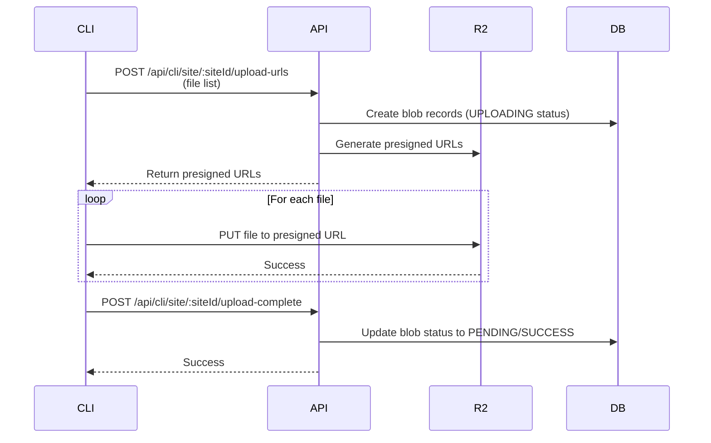

# FlowerShow CLI Authentication

The FlowerShow CLI uses OAuth Device Flow authentication to securely connect your CLI to your FlowerShow account. This allows you to publish sites under your authenticated user account.

## Overview

Authentication is required for all CLI commands (`publish`, `list`, `delete`). The authentication flow uses a browser-based OAuth process similar to GitHub CLI's `gh auth login`.

## Authentication Commands

### `flowershow auth login`

Authenticate with FlowerShow via your browser.

**Usage:**

```bash
flowershow auth login
```

**Flow:**

1. The CLI will display a URL and a verification code
2. Open the URL in your browser (it will open automatically if possible)
3. Enter the verification code when prompted
4. Sign in with your FlowerShow account (GitHub OAuth)
5. Authorize the CLI application
6. Return to your terminal - you're now authenticated!

**Example:**

```bash
$ flowershow auth login

💐 FlowerShow CLI - Authentication

Initiating authentication...

Please complete authentication in your browser:

  https://cloud.flowershow.app/cli/verify?code=WDJB-MJHT

Waiting for authorization...
(This code expires in 15 minutes)

✓ Successfully authenticated!

Logged in as: @username

You can now use the CLI to publish your sites.
```

### `flowershow auth status`

Check your current authentication status.

**Usage:**

```bash
flowershow auth status
```

**Example (authenticated):**

```bash
$ flowershow auth status

💐 FlowerShow CLI - Auth Status

Checking authentication status...

✓ Authenticated

Logged in as: @username
Token saved: Dec 21, 2025 at 1:00 PM
Token expires: Never
```

**Example (not authenticated):**

```bash
$ flowershow auth status

💐 FlowerShow CLI - Auth Status

✗ Not authenticated

Run `flowershow auth login` to authenticate.
```

### `flowershow auth logout`

Remove your stored authentication token.

**Usage:**

```bash
flowershow auth logout
```

**Example:**

```bash
$ flowershow auth logout

💐 FlowerShow CLI - Logout

✓ Successfully logged out

Your authentication token has been removed.
```

## How Authentication Works

### OAuth Device Flow

The FlowerShow CLI uses the OAuth 2.0 Device Authorization Grant (RFC 8628), which is designed for CLI tools and devices with limited input capabilities.

**The flow:**

1. **Device Code Request**: CLI requests a device code from the FlowerShow API
2. **User Authorization**: You visit a URL in your browser and authorize the CLI
3. **Token Polling**: CLI polls the API until you complete authorization
4. **Token Storage**: Once authorized, the CLI receives and stores an access token
5. **Authenticated Requests**: All subsequent commands use this token

### Token Storage

Your authentication token is stored locally in:

```
~/.flowershow/token.json
```

This file contains:

- Your access token (prefixed with `fs_cli_`)
- Your username
- When the token was saved

**Security Notes:**

- The token file is stored in your home directory
- Tokens do not expire by default
- You can revoke tokens from the FlowerShow dashboard
- Never share your token or commit it to version control

### Token Format

CLI tokens use the prefix `fs_cli_` to identify them as FlowerShow CLI tokens. This helps with:

- Token scanning in logs
- Identifying token type
- Preventing accidental exposure

## Troubleshooting

### "You must be authenticated to use this command"

Run `flowershow auth login` to authenticate.

### "Authentication token is invalid or expired"

Your token may have been revoked. Run `flowershow auth logout` followed by `flowershow auth login` to re-authenticate.

### "Failed to connect to Flowershow API"

Check your internet connection and ensure `https://cloud.flowershow.app` is accessible.

### Token not working after authentication

1. Check your authentication status: `flowershow auth status`
2. Try logging out and back in:
   ```bash
   flowershow auth logout
   flowershow auth login
   ```

## Managing Tokens

### View Active Tokens

You can view and manage your CLI tokens from the FlowerShow dashboard:

1. Go to https://cloud.flowershow.app
2. Navigate to Settings → Tokens
3. View all active CLI tokens
4. Revoke tokens you no longer need

### Revoking Tokens

**From CLI:**

```bash
flowershow auth logout
```

**From Dashboard:**

1. Go to Settings → Tokens
2. Find the token you want to revoke
3. Click "Revoke"

## File Upload Strategy for Flowershow CLI: Presigned URLs (Direct to R2)

**Flow:**


